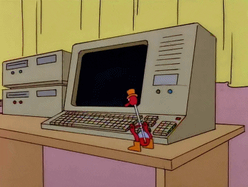

# move-mouse

Do you want to keep your screen alive? Just type `make` and launch `dist/move-mouse.exe`. It will move your mouse until you press Ctrl+C.

If you pass two arguments to the program, it will move to those screen coordinates, click twice (not a double click) and return to where it was.

Don't abuse it.
